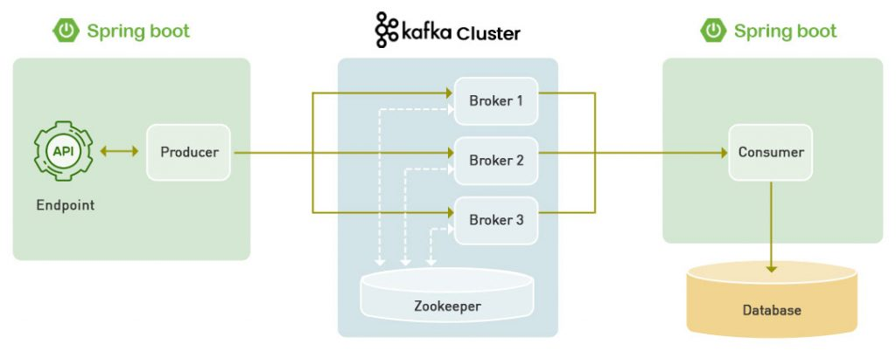
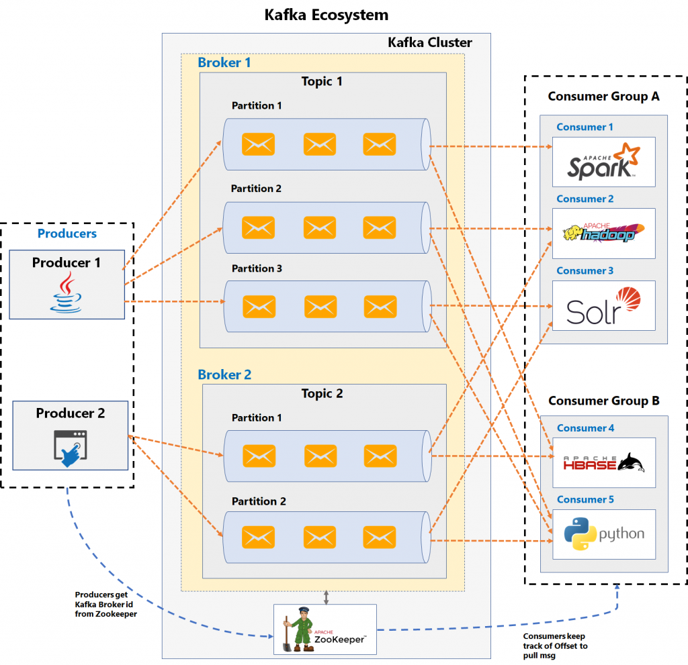
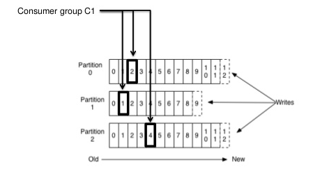

# Apache Kafka

Kafka combines three key capabilities, so you can implement your use cases for event streaming end-to-end with
a single battle-tested solution:

To publish (write) and subscribe to (read) streams of events, including continuous import/export of your data from other systems.
To store streams of events durably and reliably for as long as you want.
To process streams of events as they occur or retrospectively.

Kafka provides all this functionality in a distributed, highly scalable, elastic, fault-tolerant, and secure manner.
Kafka can be deployed on bare-metal hardware, virtual machines, and containers, and on-premises as well as in the cloud.
You can choose between self-managing your Kafka environments and using fully managed services offered by a variety of vendors.

[Download links](https://kafka.apache.org/downloads)

*WARNING: Make sure to download the binary, and not the source.*

## Installing Kafka

Start by extracting Kafka to your C-drive, or wherever you please.

*Do note that in this repository commands will be documented for an installation on the 'c:\' path.*

In the kafka directory create 2 additional folders:
- kafka-logs
- zookeeper-data

In the config folder edit (and uncomment) these lines:
- In server.properties

        advertised.listeners=PLAINTEXT://localhost:9092
        ...
        log.dirs=C:/kafka/kafka-logs

- In zookeeper.properties

        dataDir=C:/kafka/zookeeper-data

*Make sure to change the kafka directory to whichever directory kafka was extracted.
It might contain some extra version information.*

## Running Kafka

Kafka comes with a map of batch scripts for windows within the map containing shell scripts for a Unix/Linux shell.
The commands shown in this repository will be those for a Windows system and normalized to the '~/kafka/bin/windows' folder.
For examples of commands in a shell terminal you can go [here](https://github.com/dilipsundarraj1/TeachApacheKafka/blob/master/Kafka_Commands.md).

Open a terminal and change directory to the Windows folder:

> cd kafka/bin/windows

### Start Zookeeper Server

In Powershell we run batch files starting with './', while if we use command prompt we don't.

- Powershell:
> ./zookeeper-server-start.bat ../../config/zookeeper.properties

- Command prompt:
> zookeeper-server-start.bat ../../config/zookeeper.properties

*We will be using Powershell, for more info on installing, using and configuring Powershell and Windows Terminal go
[here](https://github.com/H3AR7B3A7/WindowsTerminalAndPowershell).*

### Start Kafka Server / Broker

> ./kafka-server-start.bat ../../config/server.properties

## Architecture

### Kafka In Software Architecture

*A simple representation of Kafka in software architecture:*

*A more detailed example of Kafka in software architecture (with multiple producers and consumers):*

### Topics

*A consumer group reading multiple partitions (at different offsets) from a topic:*

## Kafka Through Console

### Create Topic

> ./kafka-topics --create --topic MyTopic -zookeeper localhost:2181 --replication-factor 1 --partitions 1

### Check Topics

> ./kafka-topics --describe --zookeeper localhost:2181

### Create a Console Producer

> ./kafka-console-producer --broker-list localhost:9092 --topic MyTopic

### Create a Console Consumer

> ./kafka-console-consumer --bootstrap-server localhost:9092 --topic MyTopic --from-beginning

for /R "C:\" %%G in (*.png *.jpg *.jpeg *.gif) do copy "%%G" "C:\allPictures\"
pause

---
*Work in progress*